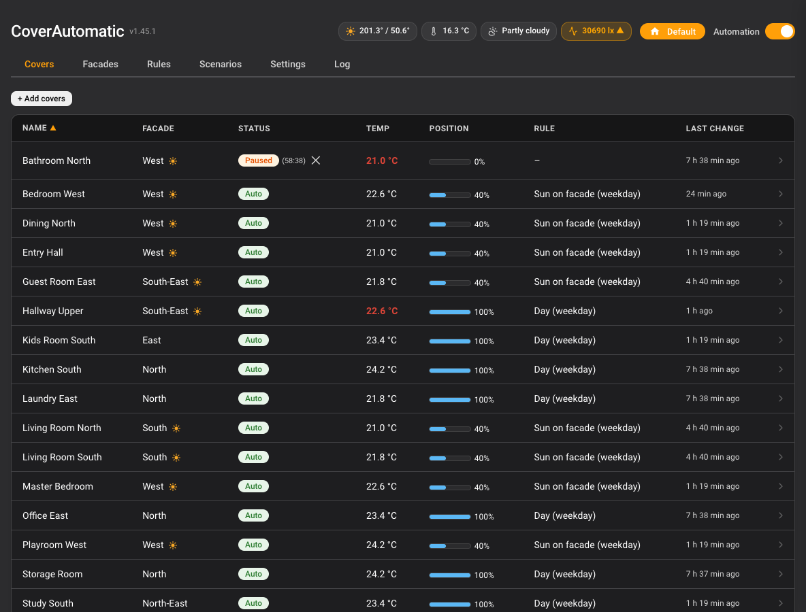
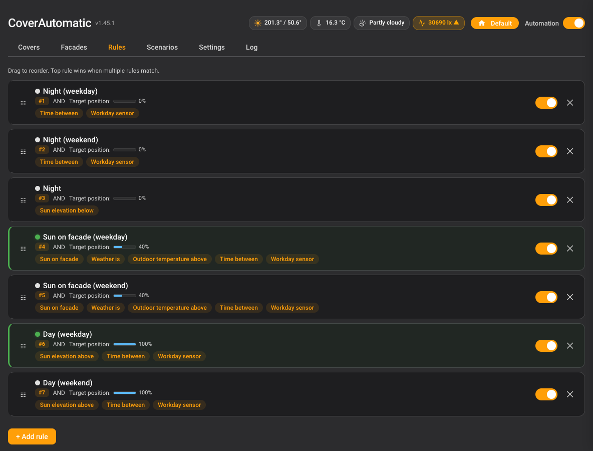
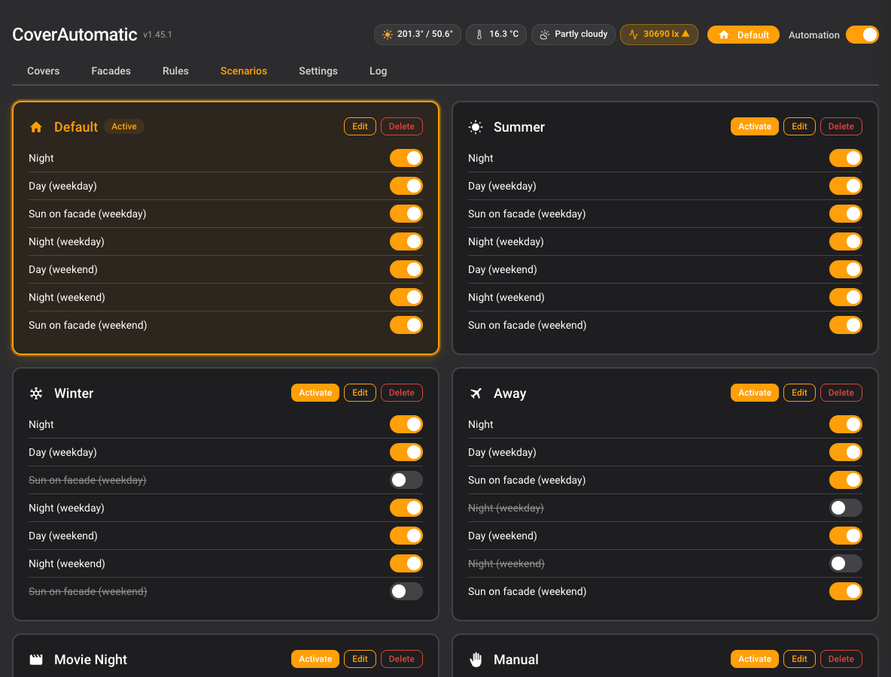
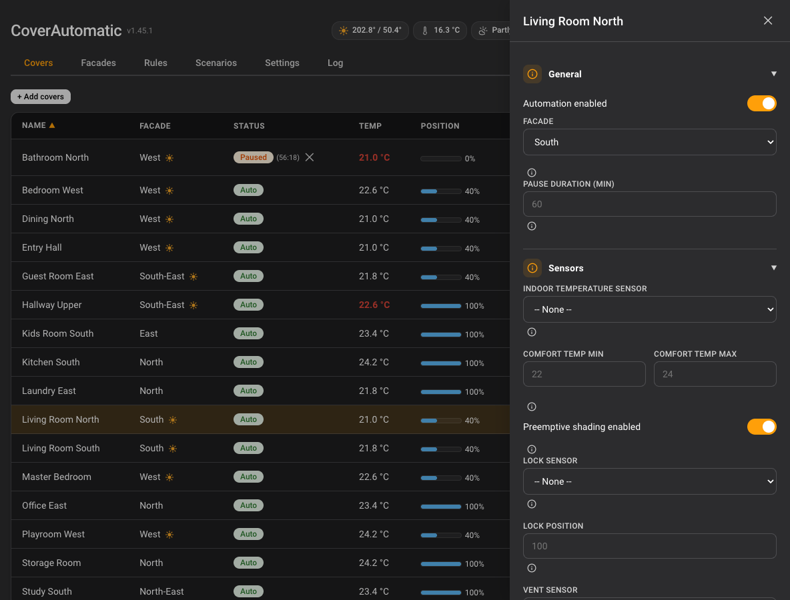
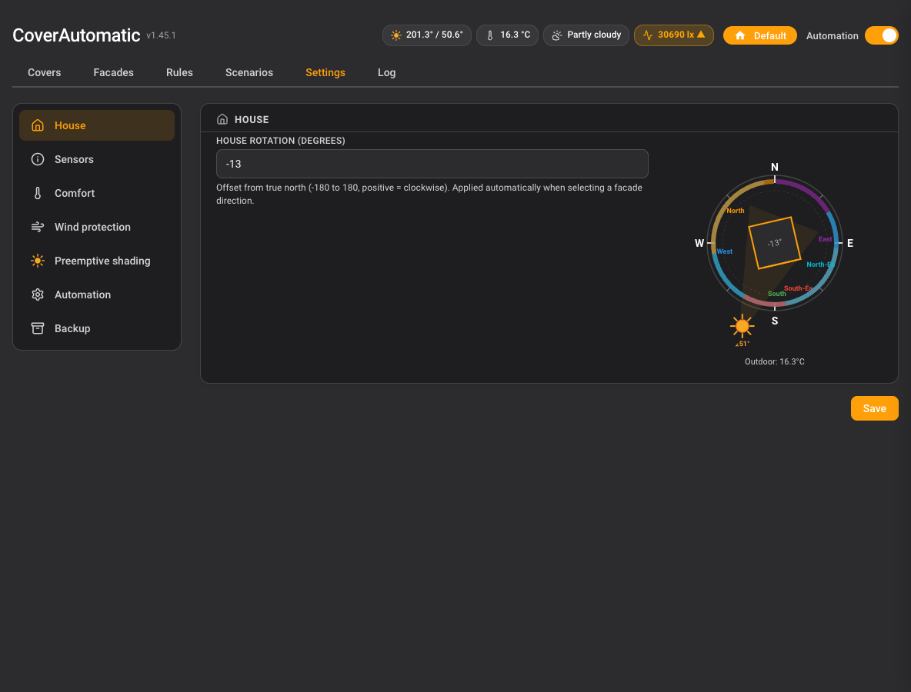
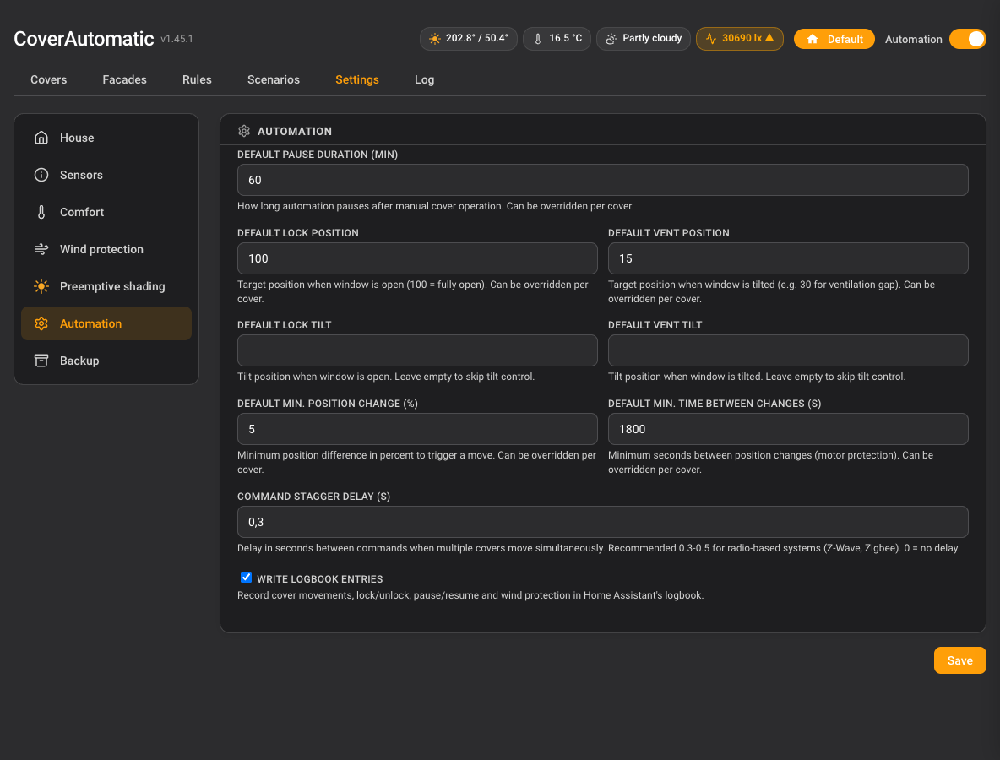
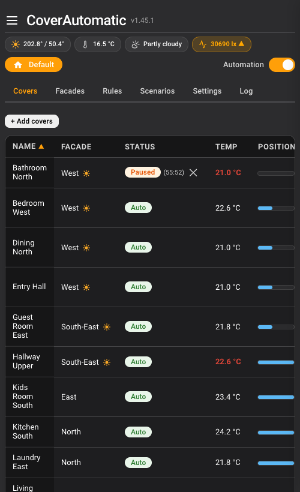
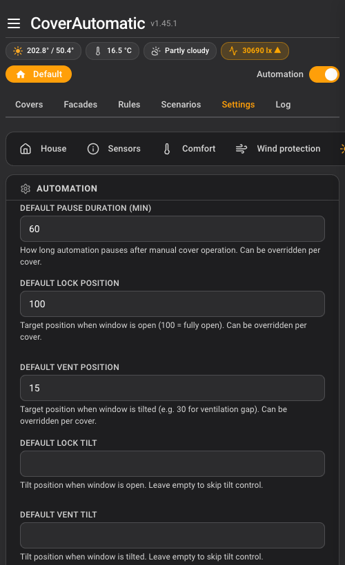

  

<h1 align="center">CoverAutomatic</h1>

<strong>Custom HACS integration for Home Assistant - intelligent, automated control of covers (shutters, blinds, roller blinds).</strong>

  
  
  
  
  

---

> **DEVELOPMENT VERSION - USE AT YOUR OWN RISK**
>
> This is a private hobby project in active development. It is **not** a finished product.
> Features may be incomplete, buggy, or change without notice.

---

## Disclaimer

**NO WARRANTY - NO LIABILITY**

This software is provided "as is", without warranty of any kind, express or implied, including but not limited to the warranties of merchantability, fitness for a particular purpose and noninfringement.

In no event shall the author be liable for any claim, damages or other liability, whether in an action of contract, tort or otherwise, arising from, out of or in connection with the software or the use or other dealings in the software.

**By using this software, you acknowledge that:**
- This is experimental software that may contain bugs
- Incorrect cover positions could affect your home's security or climate
- You are solely responsible for testing and validating the behavior
- The author assumes no responsibility for any damage to property or equipment

---

## Features

- **Sun-based automation** - Automatic shading when sun hits facade
- **Temperature control** - React to indoor/outdoor temperatures with comfort range
- **Weather integration** - React to weather conditions (sunny, cloudy, rainy)
- **Time schedules** - Open/close at specific times or relative to sunrise/sunset
- **Scenarios** - Switch between modes like "Summer", "Winter", "Vacation"
- **Manual override** - Automatic pause after manual intervention
- **Window contact sensor** - Lock cover open when window is opened (configurable position)
- **Ventilation sensor** - Move cover to ventilation position when vent is opened
- **Sun entry/exit times** - Shows when sun will hit or leave each facade
- **Hysteresis** - Prevents excessive motor wear with min position/time thresholds
- **Inverted covers** - Support for covers where 100% = closed
- **UI-first configuration** - Full setup via Home Assistant UI
- **Device agnostic** - Works with any cover entity (Homematic IP, Shelly, etc.)

## Screenshots

The integration ships with a custom sidebar panel that replaces the traditional Options Flow. All configuration happens inside Home Assistant, no YAML required. Click any thumbnail for the full-size view.

<table>
  <tr>
    <td width="33%">
      
      
<b>Covers</b> - widget header, merged position column, status badges

    </td>
    <td width="33%">
      
      
<b>Rules</b> - priority ordering, active indicators, condition chips

    </td>
    <td width="33%">
      
      
<b>Scenarios</b> - rule sets with active highlight and per-rule toggles

    </td>
  </tr>
  <tr>
    <td width="33%">
      
      
<b>Cover editor</b> - slide-out with sections, inline toggles, collapsed hints

    </td>
    <td width="33%">
      
      
<b>Settings - House</b> - rotation input with visual compass

    </td>
    <td width="33%">
      
      
<b>Settings - Automation</b> - global defaults, sidebar navigation

    </td>
  </tr>
</table>

<table>
  <tr>
    <td width="50%" align="center">
      
      
<b>Mobile - Covers</b> - stacked header, sticky name column

    </td>
    <td width="50%" align="center">
      
      
<b>Mobile - Settings</b> - sidebar collapses to horizontal pills

    </td>
  </tr>
</table>

## Requirements

- Home Assistant 2026.3.0 or newer
- HACS (Home Assistant Community Store) installed
- Existing cover entities to control

---

## Installation

### Method 1: HACS (Recommended)

#### Step 1: Add Custom Repository

1. Open Home Assistant
2. Navigate to **HACS** in the sidebar
3. Click on **Integrations**
4. Click the **three dots menu** (top right corner)
5. Select **Custom repositories**
6. In the dialog:
   - **Repository:** `https://github.com/crandler/CoverAutomatic`
   - **Category:** `Integration`
7. Click **Add**

#### Step 2: Install the Integration

1. In HACS Integrations, click **+ Explore & Download Repositories**
2. Search for **CoverAutomatic**
3. Click on it and then click **Download**
4. Select the latest version and confirm

#### Step 3: Restart Home Assistant

1. Go to **Settings** > **System** > **Restart**
2. Click **Restart** and wait for Home Assistant to come back online

#### Step 4: Add the Integration

1. Go to **Settings** > **Devices & Services**
2. Click **+ Add Integration** (bottom right)
3. Search for **CoverAutomatic**
4. Confirm the setup (zero-config, no input needed)
5. A new **CoverAutomatic** entry appears in the sidebar for full configuration

---

### Method 2: Manual Installation

1. Download the latest release from GitHub
2. Extract and copy the `custom_components/cover_automatic` folder to your Home Assistant `config/custom_components/` directory
3. Restart Home Assistant
4. Add the integration via **Settings** > **Devices & Services** > **Add Integration**

---

## Configuration

After installation, all configuration is done via the **CoverAutomatic** sidebar panel:

1. **Covers** - Add cover entities to manage
2. **Facades** - Define building facades by cardinal direction (with compass visualization)
3. **Rules** - Create automation rules with conditions (sun, temperature, time, weather, etc.)
4. **Scenarios** - Define modes like "Summer", "Winter", "Vacation" to disable specific rules
5. **Settings** - Configure sensors, comfort temperatures, wind protection, and more

### Example: heat protection by outdoor temperature

To shade a facade once it gets hot outside, combine two conditions in one rule
(operator **AND**). No extra setting is required — `temperature_above` reads the
global outdoor temperature sensor from **Settings** by default.

1. Set an **outdoor temperature sensor** in Settings.
2. Create a rule, e.g. *"Heat protection South"*:
   - Condition `sun_on_facade` → your south facade
   - Condition `temperature_above` → `28` (°C)
   - Target position → e.g. `30` (partly closed)
3. Optional: give it a higher priority than your everyday daylight rule so it
   wins while the sun is on the facade and it is hot.

The rule closes the cover only while the sun actually hits that facade **and**
the outdoor temperature is above the threshold, and releases it again once
either condition clears.

### Created Entities

For each managed cover, the integration creates:

| Entity | Description |
|--------|-------------|
| `switch.*_auto` | Enable/disable automation |
| `sensor.*_status` | Current status (auto/paused/manual/locked/venting/wind_protected) |

For each facade:
| Entity | Description |
|--------|-------------|
| `sensor.*_sun` | Sun on facade indicator (on/off) |
| `sensor.*_sun_entry` | Time when sun enters facade |
| `sensor.*_sun_exit` | Time when sun leaves facade |

Global:
- `select.cover_automatic_scenario` - Active scenario selector

Note: The integration controls your original cover entities directly. No wrapper entities are created.

### Available Services

| Service | Description |
|---------|-------------|
| `cover_automatic.pause` | Pause automation for a cover |
| `cover_automatic.resume` | Resume automation for a cover |
| `cover_automatic.pause_all` | Pause all covers |
| `cover_automatic.resume_all` | Resume all covers |
| `cover_automatic.set_scenario` | Set active scenario |
| `cover_automatic.export_config` | Export configuration to YAML |
| `cover_automatic.import_config` | Import configuration from YAML |

---

## Troubleshooting

Most "bugs" turn out to be one of the safety mechanisms below doing its job. Please check this list before opening an issue.

### Covers don't move right after a Home Assistant restart

By design. After startup, CoverAutomatic waits **120 seconds** before applying any positions. This grace period prevents wrong movements while sensors are still reporting incomplete data (e.g. a Zigbee bridge that hasn't reconnected yet). Automation starts on the first scan after the grace period.

### A cover suddenly shows PAUSED

CoverAutomatic detected a **manual override**: the cover was moved by something other than CoverAutomatic itself — a wall switch, a remote, another automation, or the HA UI. Automation for that cover pauses for the configured pause duration (global or per-cover) so your manual choice is respected, then resumes automatically. Resume earlier via the **X** button in the panel or the `cover_automatic.resume` service.

### A rule matches but the cover doesn't move

Check in this order:

1. **Status priority** — WIND_PROTECTED, LOCKED (window open), VENTING (window tilted) and PAUSED all override rule evaluation. The covers table in the panel shows the current status and the winning rule per cover.
2. **Master switch / per-cover automation toggle** — both must be on.
3. **Active scenario** — scenarios can disable specific rules.
4. **Minimum time between changes** — position changes are rate-limited by the configured interval; the move happens on a later scan.

### A sun rule doesn't shade

`sun_on_facade` is comfort-aware: in **HEATING** mode (room below comfort range) shading is blocked to let the sun warm the room. In **NEUTRAL** mode shading additionally requires the solar radiation sensor to be above the threshold (preemptive shading, can be disabled per cover). In **COOLING** mode (room above comfort range) shading always applies.

### Cover is stuck in LOCKED or VENTING

These statuses are derived from the configured window contact sensors: lock = window open (automation fully blocked), vent = window tilted (cover keeps a minimum position). If the sensor itself is `unavailable` or `unknown`, the last derived status is kept for safety — check the sensor, not the integration.

### Panel looks broken or outdated after an update

The panel JS is cache-busted per version, but some browsers hold on to it anyway. Hard-reload the browser (Ctrl/Cmd+Shift+R) or clear the app cache in the HA companion app.

### Enable debug logging

Settings → Devices & Services → **CoverAutomatic** → three-dot menu → **Enable debug logging**. Reproduce the issue, then disable debug logging the same way — Home Assistant offers the captured log as a download. Attach it to your bug report together with an export from `cover_automatic.export_config`.

Still stuck? [Open a bug report](https://github.com/crandler/CoverAutomatic/issues/new?template=bug_report.yml) — the form asks for everything needed to help you quickly.

---

## Privacy

- **Update check:** When the configuration panel is open, it makes an anonymous `GET` request to the public GitHub API (`api.github.com`, hosted in the USA) to read the latest published release tag and show an update hint. No account, token, or personal data is sent; it is a standard unauthenticated request. You can disable this entirely via **Settings → Automation → Check for updates** — with the option off, no outbound request is made. Automation itself never contacts GitHub.
- **Configuration export:** Exported/imported YAML contains your sensor and cover entity IDs. Entity IDs you named after rooms or people (e.g. `cover.bedroom_anna`) may carry a personal reference. Treat export files like any other config backup and store them accordingly.

---

## Version

1.60.0

## Changelog

Full version history is maintained in [CHANGELOG.md](CHANGELOG.md), formatted per [Keep a Changelog](https://keepachangelog.com/).

Latest release: [v1.60.0](https://github.com/crandler/CoverAutomatic/releases/tag/v1.60.0) (2026-08-18).

## License

MIT License

Copyright (c) 2026

Permission is hereby granted, free of charge, to any person obtaining a copy
of this software and associated documentation files (the "Software"), to deal
in the Software without restriction, including without limitation the rights
to use, copy, modify, merge, publish, distribute, sublicense, and/or sell
copies of the Software, and to permit persons to whom the Software is
furnished to do so, subject to the following conditions:

The above copyright notice and this permission notice shall be included in all
copies or substantial portions of the Software.

THE SOFTWARE IS PROVIDED "AS IS", WITHOUT WARRANTY OF ANY KIND, EXPRESS OR
IMPLIED, INCLUDING BUT NOT LIMITED TO THE WARRANTIES OF MERCHANTABILITY,
FITNESS FOR A PARTICULAR PURPOSE AND NONINFRINGEMENT. IN NO EVENT SHALL THE
AUTHORS OR COPYRIGHT HOLDERS BE LIABLE FOR ANY CLAIM, DAMAGES OR OTHER
LIABILITY, WHETHER IN AN ACTION OF CONTRACT, TORT OR OTHERWISE, ARISING FROM,
OUT OF OR IN CONNECTION WITH THE SOFTWARE OR THE USE OR OTHER DEALINGS IN THE
SOFTWARE.

---

## Author

Private project by [@crandler](https://github.com/crandler)

**This is not an official product. Use at your own risk.**

---

## Development

This project was developed with AI assistance (Claude by Anthropic) under human supervision and review. All code has been reviewed and approved by a human developer before being committed.

**AI-Assisted | Human-in-the-Loop | Code Reviewed**
